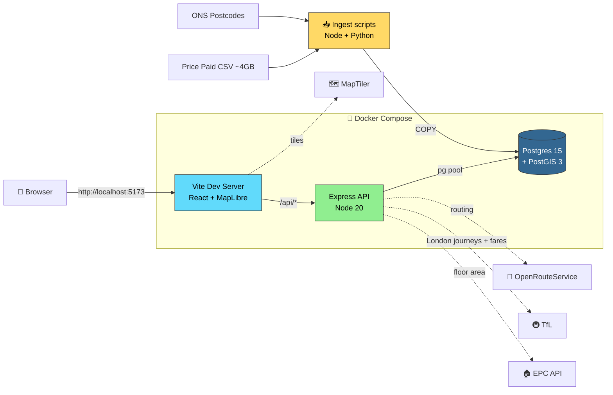

<div align="center">

# 🏠 Housing Map

### Find where you can actually afford to live in the UK

*An interactive map of every UK postcode sector, ranked by what you can buy for your budget — with real commute costs, council tax, and inflation-adjusted prices baked in.*

<p>
  
  
  
  
</p>

<!--
  Hero image — used by GitHub's social preview and pulled into LinkedIn
  / Slack / Twitter link previews when this repo is shared.
-->
<a href="docs/demo.mp4">
  
</a>

<!--
  Inline demo — GitHub renders <video> tags directly in the README.
  Click-through fallback above keeps LinkedIn / non-video clients sensible.
-->
<video src="docs/demo.mp4" width="820" controls muted autoplay loop playsinline></video>

<p><em>30-second demo: budget input → heatmap → real TfL fare lookup → affordability ranking.</em></p>

</div>

---

## ✨ What it does

| | |
|---|---|
| 🗺 **Sector-level affordability** | Every UK postcode sector ranked by what your budget can buy — at any zoom level. |
| 💰 **Inflation-adjusted prices** | Median prices uplifted by CPIH from the transaction year to the latest available year. |
| 🚌 **Real commute costs** | OpenRouteService for time/distance everywhere, **real TfL fares** inside London. |
| 🏛 **Council tax overlay** | Band D rates for England + Wales merged into the affordability score. |
| 🏠 **Floor-area enrichment** | Optional EPC Open Data lookup for £/m² comparisons. |
| ⚡ **Fast** | Bulk-COPY ingest gets you from raw CSV to live map in ~15 minutes. |

---

## 🚀 Quick start

```bash
# macOS / Linux / WSL2
./scripts/setup.sh

# Windows (PowerShell)
powershell -ExecutionPolicy Bypass -File scripts\setup.ps1
```

That single command:

1. ✅ Checks Docker, curl, unzip are present
2. 📁 Creates `.env` files from templates (asks you to fill in keys, then exits)
3. 🏗 Auto-detects host architecture (`linux/arm64` on Apple Silicon, `linux/amd64` elsewhere)
4. 📥 Downloads ~4 GB of open data
5. 🐳 Builds and starts the Docker stack
6. 🗄 Runs every ingest in the right order

First-time runtime: **~15–25 minutes** (mostly the Price Paid download).
Then open **http://localhost:5173**.

---

## 📋 Table of contents

- [✨ What it does](#-what-it-does)
- [🚀 Quick start](#-quick-start)
- [🛠 Prerequisites](#-prerequisites)
- [🔑 API keys — bring your own](#-api-keys--bring-your-own)
- [🏗 Architecture](#-architecture)
- [📦 Manual setup](#-manual-setup)
- [🗺 Optional data (council tax)](#-optional-data-council-tax)
- [⚙️ Day-to-day commands](#-day-to-day-commands)
- [🔌 API endpoints](#-api-endpoints)
- [🐛 Troubleshooting](#-troubleshooting)
- [🛣 Roadmap](#-roadmap)
- [📝 Attribution & licence](#-attribution--licence)

---

## 🛠 Prerequisites

| Tool | Required | Install |
|---|---|---|
| **Docker Desktop** | ✅ | [docker.com](https://www.docker.com/products/docker-desktop/) |
| **curl** | ✅ | macOS/Windows/Linux: built-in |
| **unzip** | ✅ | macOS/Windows/Linux: built-in |
| **Bash** *(macOS/Linux)* or **PowerShell 5+** *(Windows)* | ✅ | Pre-installed |
| **Python 3** | optional | Only for re-converting council-tax ODS/XLSX |

> 💡 **You do *not* need Node.js on your host** — it runs inside the container.

**Resource recommendations**

- 6 GB+ RAM allocated to Docker (Docker Desktop → Settings → Resources)
- ~10 GB free disk (raw CSVs ~5 GB + Postgres DB ~3–5 GB)

---

## 🔑 API keys — bring your own

> ⚠️ **This repo ships zero API keys.** Every key below is on a free tier — sign up for your own (2–5 min each). **Do not reuse keys from anyone else's clone** — they're rate-limited per account and you'll either get throttled or burn someone else's quota.

<table>
  <thead>
    <tr><th>Key</th><th>Required?</th><th>What it unlocks</th><th>Get one (free)</th></tr>
  </thead>
  <tbody>
    <tr>
      <td><code>VITE_MAP_STYLE_URL</code></td>
      <td>✅ <b>Required</b></td>
      <td>The map renders at all</td>
      <td><a href="https://www.maptiler.com/">maptiler.com</a> → pick a style → copy JSON style URL</td>
    </tr>
    <tr>
      <td><code>ORS_API_KEY</code></td>
      <td>⚠️ Needed for commute</td>
      <td>Travel time + distance (everywhere outside London, and London fallback)</td>
      <td><a href="https://openrouteservice.org/dev/#/signup">openrouteservice.org</a></td>
    </tr>
    <tr>
      <td><code>TFL_APP_KEY</code><br>(+ optional <code>TFL_APP_ID</code>)</td>
      <td>🟡 Recommended for London</td>
      <td><b>Real TfL fares</b> + multi-modal routing (tube, bus, DLR, overground, train, tram). Without it, London trips fall back to distance-based estimates and affordability is wrong for London users.</td>
      <td><a href="https://api-portal.tfl.gov.uk/">api-portal.tfl.gov.uk</a></td>
    </tr>
    <tr>
      <td><code>EPC_API_EMAIL</code> + <code>EPC_API_KEY</code></td>
      <td>🟡 Optional</td>
      <td>Floor-area (m²) enrichment per property</td>
      <td><a href="https://epc.opendatacommunities.org/">epc.opendatacommunities.org</a></td>
    </tr>
  </tbody>
</table>

### 🎯 Pick the keys you actually need

| If you want to… | Keys you need |
|---|---|
| Just see the map | 1 (MapTiler) |
| Use commute / affordability filters | 1 + 2 |
| Get accurate **London** commute costs | 1 + 2 + 3 |
| Full feature parity (floor-area, etc.) | All four |

All keys go in the **root `.env`** (git-ignored). The setup script creates it from the template and asks you to fill it in on first run.

---

## 🏗 Architecture



**Tech stack**

| Layer | Tech |
|---|---|
| Frontend | React 18 · TypeScript · Vite · Tailwind · MapLibre GL · PMTiles |
| API | Node 20 · Express · `pg` · `pg-copy-streams` |
| Database | PostgreSQL 15 + PostGIS 3 (custom Debian-based image) |
| Ingest | Node scripts + Python (ODS/XLSX converters) |
| Infra | Docker Compose (3 services: db, server, web) |

---

## 📦 Manual setup

<details>
<summary><b>Click to expand if you'd rather not use the bootstrap script</b></summary>

### 1. Clone & configure

```bash
git clone <repo-url> housing-map
cd housing-map
cp .env.example .env
cp server/.env.example server/.env
```

Edit `.env` and fill in your keys — see the **[🔑 API keys](#-api-keys--bring-your-own)** section above for which ones you need. At minimum: `VITE_MAP_STYLE_URL`.

### 2. Download the data

```bash
# Bash
./scripts/download-data.sh

# PowerShell
powershell -ExecutionPolicy Bypass -File scripts\download-data.ps1
```

Grabs:
- **Price Paid** (~4 GB) → `data/price-paid/ppd.csv`
- **ONS Postcode Directory** (~200 MB zip) → `data/postcode-directory/ons_postcode_directory.csv`

Re-run with `--force` (Bash) or `-Force` (PowerShell) to redownload.

### 3. Start the stack

```bash
docker compose up -d --build
```

| Container | What | Host port |
|---|---|---|
| `housing-map-db` | Postgres 15 + PostGIS 3 | `55432` |
| `housing-map-server` | Node API | `5050` |
| `housing-map-web` | Vite dev server | `5173` |

### 4. Run all ingests

```bash
# Bash
./scripts/ingest-all.sh

# PowerShell
powershell -ExecutionPolicy Bypass -File scripts\ingest-all.ps1
```

| # | Step | ~Time |
|---|---|---|
| 1 | `ingest-price-paid.js` (bulk COPY of 30M rows) | 3–8 min |
| 2 | `ingest-postcodes.js` (COPY of 2.7M rows) | 1–2 min |
| 3 | `fetch-cpih.js` (ONS inflation index) | ~2 sec |
| 4 | `ingest-council-tax.js` England (optional) | <1 sec |
| 5 | `ingest-council-tax.js` Wales (optional) | <1 sec |
| 6 | `compute-sector-stats.js` (aggregations) | 1–3 min |

### 5. Verify and open

```bash
curl http://localhost:5050/api/health
docker compose exec db sh -lc "/scripts/db-sanity.sh"
```

Then visit **http://localhost:5173**.

</details>

---

## 🗺 Optional data (council tax)

Council Tax data has no stable URL — yearly files must be fetched manually.

<details>
<summary><b>England (Band D, 2025–26)</b></summary>

1. Download `Band_D_2025-26.ods` from [gov.uk council tax statistics](https://www.gov.uk/government/statistics/council-tax-levels-set-by-local-authorities-in-england-2025-to-2026)
2. Place at `data/Band_D_2025-26.ods`
3. Convert: `python3 server/scripts/convert-council-tax-ods.py`
4. Re-run the ingest pipeline (or just `ingest-council-tax.js`)

</details>

<details>
<summary><b>Wales (Band D, 2025–26)</b></summary>

1. Download `council-tax-levels-in-wales-2025-26.xlsx` from [gov.wales](https://www.gov.wales/council-tax-levels)
2. Download the LAD lookup `Local_Authority_Districts_(April_2025)_Names_and_Codes_in_the_UK_v2.csv` from [ONS Open Geography Portal](https://geoportal.statistics.gov.uk/)
3. Place both in `data/`
4. Convert: `python3 server/scripts/convert-council-tax-wales-xlsx.py`
5. Re-run the ingest pipeline

</details>

---

## ⚙️ Day-to-day commands

```bash
docker compose up -d            # start the stack
docker compose down             # stop (keeps DB volume)
docker compose down -v          # stop AND wipe the DB
docker compose logs -f server   # tail one service's logs
docker compose restart web      # apply .env changes for the web container
./scripts/ingest-all.sh         # re-ingest after data refresh
```

**Re-run a single ingest**

```bash
docker compose run --rm server sh -lc "node scripts/ingest-postcodes.js"
docker compose run --rm server sh -lc "node scripts/compute-sector-stats.js"
```

---

## 🔌 API endpoints

| Method | Path | Purpose |
|---|---|---|
| `GET` | `/api/health` | Liveness check |
| `GET` | `/api/postcode?postcode=SW1A1AA` | Postcode → lat/lng |
| `GET` | `/api/price-paid?postcode=SW1A1AA` | All Price Paid txns for a postcode |
| `GET` | `/api/price-paid/viewport?bbox=...` | Viewport-bounded txns *(rate-limited)* |
| `GET` | `/api/sectors/viewport?bbox=...` | Sector centroids in viewport |
| `POST` | `/api/sector-rankings` | Affordability-ranked sectors |
| `POST` | `/api/affordable-heatmap` | Heatmap data for affordability layer |
| `GET` | `/api/council-tax?postcode=...` | Council Tax Band D for a postcode's LAD |

---

## 🐛 Troubleshooting

| Symptom | Cause | Fix |
|---|---|---|
| `docker.sock: no such file` | Docker Desktop isn't running | macOS: `open -a Docker` · Windows: launch Docker Desktop · Linux: `sudo systemctl start docker` |
| `function st_makepoint does not exist` | PostGIS init didn't run (old volume) | `docker compose down -v && docker compose up -d --build` then re-run ingests |
| Map renders grey/blank | `VITE_MAP_STYLE_URL` is wrong or placeholder | Edit `.env`, then `docker compose restart web` |
| Ingest container OOM-killed | Docker memory too low | Docker Desktop → Settings → Resources → 6 GB+ |
| `port already allocated` | Something on 5173/5050/55432 | macOS/Linux: `lsof -i :5173` · Windows: `Get-NetTCPConnection -LocalPort 5173` |
| `platform mismatch` warning | `DB_PLATFORM` doesn't match host arch | Re-run `./scripts/setup.sh` (or `setup.ps1`) — it auto-detects and rewrites |
| Postcode ingest takes forever | Pre-COPY version of the script | `git pull` — the rewrite uses `COPY` (~60s for 2.7M rows) |

---

## 🛣 Roadmap

**Done recently** ✅

- [x] Cross-platform bootstrap (macOS, Linux, Windows, WSL2)
- [x] One-command setup (`scripts/setup.sh` / `setup.ps1`)
- [x] Auto-detect host architecture for native arm64/amd64
- [x] 60× speedup of the postcode ingest via `COPY`
- [x] Bring-your-own-keys documentation with decision tree

**Cross-platform polish** 🛠

- [ ] Native Windows path quoting (validate `COUNCIL_TAX_CSV` env var works in `cmd.exe`)
- [ ] `db-sanity.ps1` host-side Windows equivalent (current version runs inside the Linux container, so it works anyway)
- [ ] `brew` / `winget` / `scoop` / `apt` install hint parity
- [ ] Native Windows ingest-performance benchmark

**Feature backlog** 🚀

- [ ] Cache TfL `fare_gbp` in `commute_cache` (currently re-fetched each request)
- [ ] Peak/off-peak fare toggle (currently picks min)
- [ ] Real public-transport routing outside London (replace driving fallback)
- [ ] Multi-destination commutes (work + school)
- [ ] Optional carbon / eco scoring
- [ ] Council-tax download automation (gov.uk / gov.wales links aren't stable)
- [ ] Wire up placeholder adapters: `crime.js`, `landRegistry.js`, `schools.js`

---

## 📝 Attribution & licence

- 🏛 Contains **HM Land Registry data** © Crown copyright and database right 2025. Licensed under the [Open Government Licence v3.0](https://www.nationalarchives.gov.uk/doc/open-government-licence/version/3/).
- 🗺 **ONS Postcode Directory** © Crown copyright and database right 2025; contains OS data © Crown copyright and database right 2025.
- 📊 **CPIH index** © Office for National Statistics, licensed under OGL v3.0.
- 🚇 **TfL Journey data** © Transport for London, used under the [TfL Open Data Terms](https://tfl.gov.uk/info-for/open-data-users/our-open-data).
- 🏠 **EPC** data © Department for Levelling Up, Housing and Communities (Open Government Licence).
- 🧭 Map tiles © [MapTiler](https://www.maptiler.com/) and [OpenStreetMap contributors](https://www.openstreetmap.org/copyright).

---

<div align="center">

**Built with ❤️ for anyone trying to find a home in the UK.**

If this project helped you, please ⭐ the repo and share it.

</div>
